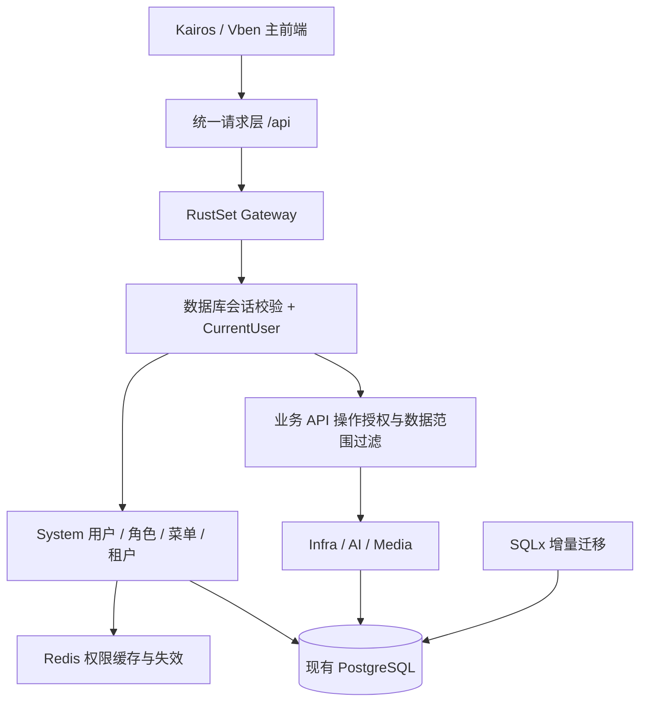

# RustSet 切换 Kairos 前端与权限体系：详细方案及实施计划

> 历史归档：本文记录 RustSet 迁移前端与权限底座时的来源、决策和阶段结果，不代表当前产品名称或功能范围。当前说明以根目录 `README.md`、`docs/technical-solution.md` 和实际代码为准。

状态：P0、P1、P2、P3 以及 P4 资产运营首批迁移已于 2026-09-24 完成；P4.1“资产采集表台账化”已于 2026-09-25 完成，并继续叠加 CMDB、组织网段归属、资产策略联查、审批规则和业务菜单拆分；P5 生产切流与 P6 稳定期收尾尚未实施。调研日期：2026-09-24，资产采集表补充设计日期：2026-09-25。

当前完成摘要：infra 当前 235 条路由经集中注册表强制认证和权限码校验（未注册默认拒绝）；bootstrap 管理员机制支持空密码条件更新与无管理员时的并发安全恢复创建。资产采集表的 43 字段资产台账和 17 字段网络策略台账已落库并接入页面/API/权限，资产可按 IP 联查命中的网络策略；资产域后续已扩展为 15 个业务页面和 63 个按钮权限，并拆分到独立业务模块菜单。Kairos/Vben 页面通过集中兼容层接入本地 API；扫描 Agent 等没有真实执行能力的功能不接假接口。新增迁移均通过空库与重入测试，参考快照随迁移链刷新。P1 摘要：全仓 CRLF 归一化；bun 正式工具链；上游菜单转换修正；RustSet 品牌；Dioxus 已删除。交付：`docs/migration/p0-baseline.md`、`docs/migration/upstream-diff.md`。

P0 结论摘要：工作区未提交变更为纯 LF→CRLF 行尾改写；本地旧库仅 yudao 演示数据可弃；前端工具链确定为 bun（全局 pnpm 已损坏，bun 安装/类型检查/构建全链路验证通过）；infra-server 223 条路由零强制认证已证实。待核实项结论见 P0 报告 §7。

## 1. 目标与推荐决策

将 RustSet 的主前端切换为 Kairos Platform 的 Vue 3 / Vben / Ant Design Vue 前端，复用其登录、动态菜单、角色、按钮权限及配套 Rust System/Security 实现。保留 RustSet 现有业务、数据和工程身份，逐步将现有业务页面接入新前端。当前已进入实施阶段。

推荐采用“以 Kairos 为前端基线，在现仓库内完成权限对齐与业务适配”的路线。用户已明确 Dioxus 不再需要：其源码、专属依赖及构建部署入口已删除，只保留 Kairos/Vben 前端，不安排双前端维护或 Dioxus 归档目录。

这里的“复用权限”包含后端鉴权、API 授权、数据访问边界和缓存失效，不止是复制登录页与隐藏按钮。源码对比表明，两边 System/Security 已高度接近，主要工作是补齐业务接入和验证闭环。

默认范围如下，后续若调整，先更新本方案范围再实施：

| 项目             | 默认决策                                                                       |
| ---------------- | ------------------------------------------------------------------------------ |
| 主前端           | 采用 Kairos 的 `apps/web` 工程及公共组件，落地到本仓库同路径                   |
| Dioxus           | 在 P0 完成功能盘点和版本备份后，于 P1 删除 `apps/web-dioxus` 及专属工程配置    |
| 权限底座         | 复用 Kairos System/Security 实现、表模型及协议；保留本项目命名与配置身份       |
| 后端             | 保留 Rust/Axum、`rustset-*` crate、现有 gateway 与业务模块                     |
| 数据             | 保留现有用户、密码哈希、角色关系、租户及业务记录，采用增量升级                 |
| 业务页面         | System、Infra、AI、Media 保留；资产相关优先复用 Kairos 对应页面                |
| Kairos 扩展业务  | Pent、扫描执行器、Agent、MCP 等不随前端迁移自动引入                            |
| 品牌             | 暂保留 RustSet，统一清理 Rust Toon / Kairos 的产品文案残留；保留第三方版权声明 |
| 数据库初始化     | 坚持本仓库 AGENTS.md：SQLx 迁移为唯一初始化路径                                |
| 对上游的维护方式 | 固定提交引入源码，记录来源与本地差异，后续按模块审查更新                       |

不推荐直接将整个仓库替换为 Kairos：它会连带切换业务模块、数据库初始化方式和运行依赖，超出当前“前端和权限复用”的必要范围。若最终目标是完整 Kairos 产品，包括 Pent/Scan，则应另设第二期整平台迁移。

## 2. 调研基线与证据

### 2.1 版本基线

- RustSet HEAD：`54247c1cc1d4f58920f094a7ac4f1df0ed8e7fbb`。
- RustSet 工作区存在大量未提交修改；本方案以当前工作区实际文件为准，不能用 HEAD 代替实施基线。
- Kairos 来源：[cola9104/kairos-platform](https://github.com/cola9104/kairos-platform)。
- 已读取的上游提交：[0d9c90efef5c178703da35294acd381ef12cd0cf](https://github.com/cola9104/kairos-platform/tree/0d9c90efef5c178703da35294acd381ef12cd0cf)。
- 上游已在仓库外临时目录完成浅克隆及源码比较；方案链接固定到提交，实施不依赖该临时目录继续存在。

本次完成的是静态源码与目录比较，未验证运行中的数据库、当前生产部署、实际用户规模、页面完整性及测试通过情况。以下区分已确认事实、目标设计和实施阶段待核实项。

### 2.2 已确认的差异

| 领域       | RustSet 现状                                                                                 | Kairos 现状                                                           | 对迁移的影响                                          |
| ---------- | -------------------------------------------------------------------------------------------- | --------------------------------------------------------------------- | ----------------------------------------------------- |
| 前端入口   | 同时存在 `apps/web-dioxus`、`apps/web`；workspace 包含 Dioxus；AGENTS 与 README 指向不同前端 | `apps/web` 的 Vben 工程                                               | 必须统一默认入口、构建、启动脚本和部署文档            |
| 前端权限链 | 现有 Vben 已有登录 store、后端菜单、路由守卫、请求拦截器                                     | 相同目录和协议，大量文件相同                                          | 可以直接对齐上游，避免重复实现                        |
| Security   | 权限字符串、JWT、CurrentUser、密码处理均存在                                                 | 忽略换行差异后，仅 4 个文件有差异，主要为包名、JWT 默认身份与测试示例 | 保留兼容身份，进行语义级合并                          |
| System     | 用户、角色、菜单、租户、会话存储、数据权限及权限缓存均存在                                   | 17 个文件有差异，大部分为命名；bootstrap 新增空密码初始化             | 重点审查 bootstrap 行为，不能据文件数量推断重写规模   |
| 菜单转换   | 已有后端菜单转换工具                                                                         | 增加分组默认跳转、无 componentName 时不启用 KeepAlive 等修正          | 将修正与配套测试一起引入                              |
| 资产页面   | Dioxus 存在资产及云平台等页面；现有 Vben 缺少上游 `asset-ops` 目录                           | Vue 页面在 `views/asset-ops`，API 文件主要在 `api/scan`               | 复用页面，但必须适配后端接口和业务语义                |
| 资产 API   | `/infra/asset/page`、`/infra/asset/create` 等操作式接口                                      | `/asset-ops/assets`、`/asset-ops/assets/{id}` 等资源式接口            | 改 URL 不足以完成迁移，还需字段、分页、错误与状态转换 |
| 数据初始化 | gateway 调用 `migrate`，有 `0001`、`0002`                                                    | gateway 调用 `ensure_initialized`，依靠完整快照                       | 不引入上游数据库启动实现及快照覆盖                    |
| 额外业务   | gateway 装配 System、Infra、AI、Media                                                        | 另外装配 Scan、Pent，并带运行时基础设施                               | 不整体复制上游 workspace 或 gateway                   |

主要本地证据路径：

- `apps/web-dioxus/src/main.rs`：现有页面及旧路由清单。
- `apps/web/apps/web-antd/src/{api/core/auth.ts,api/request.ts,store/auth.ts,router/access.ts,preferences.ts}`：现有 Vben 权限入口。
- `crates/framework/security/src/{authentication.rs,authorization.rs,permission.rs,context.rs,password.rs}`。
- `crates/modules/system-server/src/{database_auth.rs,infrastructure.rs,transport.rs,cache.rs,bootstrap.rs}`。
- `crates/modules/system-server/src/management/data_scope.rs`：数据库数据范围规则。
- `crates/modules/infra-server/src/{lib.rs,asset.rs,provider.rs,room.rs,cloud_platform.rs,business.rs,ticket.rs,task.rs,risk.rs}`。
- `crates/framework/database/src/postgres.rs` 与 `crates/framework/database/tests/migrations.rs`。

上游对应证据：[前端工程](https://github.com/cola9104/kairos-platform/tree/0d9c90efef5c178703da35294acd381ef12cd0cf/apps/web)、[System](https://github.com/cola9104/kairos-platform/tree/0d9c90efef5c178703da35294acd381ef12cd0cf/crates/modules/system-server)、[Security](https://github.com/cola9104/kairos-platform/tree/0d9c90efef5c178703da35294acd381ef12cd0cf/crates/framework/security)、[资产 API](https://github.com/cola9104/kairos-platform/tree/0d9c90efef5c178703da35294acd381ef12cd0cf/apps/web/apps/web-antd/src/api/scan)、[菜单转换](https://github.com/cola9104/kairos-platform/blob/0d9c90efef5c178703da35294acd381ef12cd0cf/apps/web/packages/utils/src/helpers/generate-menus.ts)。

### 2.3 切换前必须处理的现有问题

1. **业务路由鉴权缺口。** 本地 `asset.rs` 的资产增删改查不提取 `CurrentUser`，Infra 路由装配没有统一强制登录层；gateway 数据库鉴权中间件在无 Authorization 时放行。因此这些代码路径缺少强制认证和操作权限检查。应在隔离测试环境确认并修复，不能以菜单不可见作为保护。上游抽查的部分资产路由也不能证明已覆盖这类保护，复用后仍需逐接口验收。
2. **迁移数量断言过时。** 目录已经有 `0002_asset_management.sql`，测试仍断言只执行 1 个迁移。`0002` 存在不带 IF NOT EXISTS 的建表/序列语句。先验证真实执行状态，后续不能擅自重写已应用文件。
3. **历史迁移自动认领风险。** `reconcile_migrations` 对“已有表但没有迁移历史”的数据库，将所有已知迁移记为完成并跳过执行，可能掩盖实际缺表。其手工生成 checksum 的实现也需与锁定 SQLx 版本核对。需要显式校验 schema 的接管流程；不能通过补写成功记录假装完成升级。
4. **bootstrap 文档与代码不一致。** 本地 bootstrap 只检查管理员存在，没有实现指南描述的创建逻辑；上游增加的是给已存在的空密码账号赋值，也不等价于缺失账号创建。必须定义并测试首次启动、已有管理员、缺失管理员三种行为。
5. **租户和数据范围不完整。** `framework/tenant` 目前仅是上下文扩展点；不能当作全局隔离实现。已抽查资产表缺少 tenant_id，System 的用户列表数据权限也不会自动保护资产查询。

上述为源码事实及由调用链得出的风险判断，不代表本轮已运行漏洞验证或完成修复。

## 3. 目标架构与复用边界



### 3.1 前端

- `apps/web` 成为正式入口。引入上游时保留 pnpm workspace、`packages`、`internal`、共享样式、图标、请求层和类型定义的完整依赖关系，不能只拷贝 `web-antd/src`。
- 本地与上游相同文件直接复用；有差异的文件逐项归类为上游修正、业务增量或本地配置。用来源清单记录，避免大范围换行改写淹没有效差异。
- 保留 `accessMode: 'backend'`，由 `get-permission-info` 提供菜单与权限，菜单 component 必须对应真实 Vue 文件。
- 复用登录、用户中心、System 管理页面；逐页核实验证码、短信、社交登录等入口是否有真实后端支持，未支持的入口按能力配置关闭。
- 上游 Pent/Scan 页面不应因静态路由 glob 自动进入正式导航；检查静态路由、后端菜单、首页卡片和跨模块 import，整体移出默认发布范围。
- 新首页使用有权限且实际存在的工作台。不能盲目保留 `/workspace` 而产生登录后 404；无业务菜单用户仍能退出登录并查看适当的无权限页。
- 新增前端缓存版本，处理旧菜单、偏好、标签页及 token 存储兼容；账号/租户切换及退出时清理动态路由与缓存。
- 所有旧 Dioxus 路由建立到新路由的显式映射；跳转目标仍经过权限守卫，不能绕过授权。

P1 删除清单：整个 `apps/web-dioxus/`，根 Cargo workspace 的对应成员，仅供 Dioxus 使用的依赖和锁文件条目，dx/WASM 专属启动、构建、CI 和部署配置，以及不再被新前端引用的专属资源。依赖锁文件通过工具重新生成；共享资源先确认引用再清理。同步将开发说明改为 Vben。先在 P0 记录业务行为及旧路由，后续功能核对使用该清单和版本历史，不保留可运行的 Dioxus 工程。

### 3.2 Rust 权限底座

按实际差异复用 `framework/security`、`system-api`、`system-server`，并核对它们对 common/web/redis 的依赖。保留 crate 名 `rustset-*` 和默认 JWT issuer/audience，避免仅因重命名让现有会话失效。

不整体替换 `services/gateway/src/main.rs`、`framework/database`、根 Cargo.toml、Compose 文件。上游 bootstrap 修正可引入，但必须改为明确租户及管理员身份、条件更新空密码、并发安全，不照搬仅按 username 更新的实现。

复用保留上游来源与许可信息。已看到上游 workspace 的 MIT 声明与 `apps/web/LICENSE`；实施时保留相关第三方文件的原始版权头、许可证和来源清单。

### 3.3 业务与数据库

保留本地业务表、已有主键、外键关联及用户所有权。资产 Vue 页面通过薄的 TypeScript 适配层访问现有 `/infra/*` API；必要的字段扩展进入现有 Rust 模块。目标是只有一套业务逻辑和数据库写入路径。

第一期不为“页面能打开”而引入上游整个 scan-server，也不把现有资产搬入第二套表。若以后选择统一为 `/asset-ops/*` 后端协议，应新增兼容路由复用同一业务服务，并独立规划旧 API 的下线周期。

## 4. 权限详细设计

### 4.1 认证及授权链路

1. 登录验证用户、租户和密码状态，签发并保存 access/refresh token。
2. 受保护请求必须通过数据库会话校验；JWT 有效但会话撤销、账号禁用或租户禁用时不得继续访问。
3. 从数据库及受控缓存加载用户当前角色、权限和数据范围，形成 `CurrentUser`。
4. 每个业务操作检查对应权限码，再按租户、部门、所有者或资源归属约束读写。
5. 前端使用同一权限集合生成菜单和控制按钮；后端仍独立拒绝手工构造的越权请求。

公共路由采用小范围显式清单：例如登录、刷新、必要的租户定位与健康检查。上传下载、导出、批量操作、AI SSE、异步任务触发单独列入路由清单，不因不是普通 JSON CRUD 而遗漏认证。

### 4.2 RBAC 模型与权限码

复用现有 `system_users`、`system_role`、`system_user_role`、`system_menu`、`system_role_menu`、部门、租户套餐及 OAuth2 token 表。`system_menu` 同时承载目录、页面和按钮权限；延用上游字段语义，不再建立另一套角色管理表。

System 已有权限码优先原样保留。资产业务建议统一使用与现有 API 对应的 `infra:<resource>:<action>`；最终值先与现有菜单数据和上游页面逐项对照，下面是拟定规则，尚未执行：

| 业务                 | 拟定权限                                                                     | 约束                                                      |
| -------------------- | ---------------------------------------------------------------------------- | --------------------------------------------------------- |
| 资产                 | `infra:asset:query/create/update/delete/export`                              | `query/create/...` 表示多个独立权限码，不是带斜杠的单个值 |
| 服务商、机房、区域等 | `infra:service-provider:*`、`infra:machine-room:*` 等按动作拆分              | 普通角色按动作授予，避免直接授整个通配符                  |
| 工单                 | `infra:resource-ticket:query/create/update/delete/approve/provision/deliver` | 审批与交付独立，后端校验状态转换与资源范围                |
| 任务                 | `infra:task:query/create/update/delete/execute`                              | 查看和执行分离                                            |
| 风险                 | `infra:risk:query/update/resolve`                                            | 处理状态变更必须授权                                      |
| 云凭据               | 独立配置、测试连接、同步权限                                                 | 敏感字段不随普通列表响应返回                              |

定义权限清单：HTTP 方法、路由、handler、权限码、数据边界、审计事件、测试编号。每个受保护入口都必须覆盖；别名路由与批量接口不得漏配。未知或未配置的业务操作默认拒绝。

保留现有超级管理员约定，但新增权限不自动赋给所有已有角色。显式管理跨租户访问，不能将“超级管理员”默认解释成所有接口都可跳过租户边界。

### 4.3 数据权限与租户

System 数据范围保留数据库的 1=全部、2=自定义部门、3=本部门、4=本部门及子部门、5=本人语义。当前 `CurrentUser::DataScope` 四类枚举不能完整表达自定义部门，不能只据该枚举完成业务过滤。

实施时在共享权限接口中返回可执行的数据访问约束，并让列表、详情、修改、删除、导出及任务执行使用相同规则。多角色按现有业务语义合并，但租户边界始终为外层约束。前端传入的 `tenant-id` / `visit-tenant-id` 必须与服务端身份和授权核对。

资产域存在无 tenant_id 的旧表，必须在 P0 核实真实部署用途并选择明确模式：

- 默认先按单租户业务启用资产模块，并由服务端约束为配置的业务租户；其他租户不可读取这些共享旧表。
- 如果现有环境已需要多租户资产，则在公开新前端前完成 tenant_id、归属回填、关联约束及过滤。无法确认归属的历史数据进入隔离清单，不猜测分配给某租户。

“隐藏租户切换器”不构成数据隔离。这里的默认模式不是删除多租户数据，也不是把所有租户合并。

### 4.4 会话、缓存及密码

> 2026-09 更新：按“内部密码学全部国密化、不做旧格式兼容”的决定，本节前三条的
> 兼容保留条款已被 0018 迁移取代，见下方国密条目。

- 认证 UUID 映射改为 `system_users.identity_uuid` 列，取值 `SM3('rustset-user:' || id)` 前 16 字节（Rust 侧派生）；原 `md5('yudao-user:' || id)::uuid` 已全部移除。基线用户由 0018 字面量回填，运行时新建用户由网关写入，启动时兜底回填。
- 密码哈希统一为 PBKDF2-HMAC-SM3（`$sm3$<iter>$<salt>$<digest>`，16384 轮）；bcrypt/Argon2 不再可验证，基线 admin 密码由 0018 重置为同口令的国密哈希。静默密文（邮件/短信/数据源/云凭据）统一 SM4-CBC `enc:sm4:v2:`，XOR `enc:v1:` 仅保留一次性启动重封通道。
- 访问令牌为 HMAC-SM3 签名的紧凑 JWS（`alg=HMAC-SM3`），签发/校验都在网关内闭环；JWT_SECRET 语义不变，全体旧令牌随格式切换失效，需重新登录。
- sqlx 迁移 checksum 的 SHA-256 是 sqlx 框架自身的校验格式，不属于应用密码学，予以保留。
- 正常升级保留 JWT 配置；必要的全体重新登录只能作为明确发布策略，不能因前端重命名偶然触发。
- 现有 CurrentUser 缓存 TTL 为 300 秒。角色、菜单、用户角色、租户套餐及禁用状态变更必须失效相关用户缓存，不能把等待 TTL 当作权限撤销机制。
- 对缓存失效失败、多实例、Redis 不可用进行验证；必要时用版本号或数据库回查避免继续使用旧授权。
- 验证并发请求仅触发一次前端刷新、刷新失败退出、退出后 token 不可复用、账号切换不遗留旧路由。

## 5. API 与页面迁移清单

### 5.1 登录和公共协议

以下为实际源码中已存在的协议，应优先保持兼容：

| 接口/规则                              | 当前行为与实施要求                                                             |
| -------------------------------------- | ------------------------------------------------------------------------------ |
| `POST /system/auth/login`              | 原始 token 使用 snake_case；Vben API 层转为 accessToken/refreshToken/expiresIn |
| `POST /system/auth/refresh-token`      | 核实并保留 query `refreshToken` 的兼容路径，与后端接受的请求结构一致           |
| `POST /system/auth/logout`             | JSON 使用 `refresh_token`；核实实际请求是否携带该接口需要的认证信息            |
| `GET /system/auth/me`                  | 保持用户身份字段及 ID 映射                                                     |
| `GET /system/auth/get-permission-info` | 保留 user / roles / permissions / menus 结构，核对嵌套菜单字段                 |
| 普通 JSON 响应                         | Vben 按 `code=0`、`data` 解包；业务错误与 HTTP 401/403 都要正确呈现            |
| 上传、下载、SSE                        | 分别验证 multipart、Blob 错误及流式响应，不强行套普通 JSON 解包                |
| 浏览器 API 前缀                        | 浏览器调用 `/api/*`，Vite/Nginx 去掉 `/api` 后转发给 gateway                   |

使用真实脱敏响应固定契约样例，覆盖成功、未认证、权限不足、参数错误、空列表与大整数 ID。不要在页面中零散添加 `response.data?.data` 兜底掩盖协议差异。

### 5.2 业务页面映射

| 当前 Dioxus 路由（含部分别名）     | Kairos 可复用页面/目录           | 本地后端入口                                                         | 处理重点                                              |
| ---------------------------------- | -------------------------------- | -------------------------------------------------------------------- | ----------------------------------------------------- |
| `/system/*`                        | `views/system/*`                 | `/system/*`                                                          | 用户、角色、菜单、部门、租户及数据权限闭环            |
| `/infra/*`                         | `views/infra/*`                  | `/infra/*`                                                           | 通用管理页面逐项确认支持情况                          |
| `/ai/*`                            | `views/ai/*`                     | `/ai/*`                                                              | 保留现有能力、SSE、知识库、模型；上游新增能力单独核实 |
| `/asset/provider`、`/provider`     | `asset-ops/service-provider`     | `/infra/service-provider/*`                                          | 列表、字段及创建/更新请求转换                         |
| `/asset/room`、`/room`             | `asset-ops/machine-room`         | `/infra/machine-room/*`                                              | 服务商关联；机柜等新功能不自动承诺                    |
| `/asset/cloud`、`/cloud`           | `asset-ops/cloud-platform` 等    | `/infra/cloud-zone/*`、`cloud-platform/*`、`cloud-provider-config/*` | 多页面拆分、凭据及真实连接能力                        |
| `/asset/zone`、`/zone`             | `asset-ops/zone`                 | `/infra/network-zone/*`                                              | 本地 zone ID 为字符串，不能统一转 number              |
| `/asset/security`、`/security`     | `asset-ops/security-product`     | `/infra/security-product/*`                                          | 字典与关联资源                                        |
| `/asset/list`                      | `asset-ops/asset`                | `/infra/asset/*`                                                     | ports 数组/存储文本转换、筛选分页及端口操作           |
| `/asset/business-app`、`/business` | `asset-ops/business-application` | `/infra/business-application/*`、`application-endpoint/*`            | 应用与端点关系                                        |
| `/asset/business-resource`         | `asset-ops/business-resource`    | `/infra/business-resource/*`                                         | 字段差异、归属、资源凭据脱敏                          |
| `/asset/ticket`、`/ticket`         | `asset-ops/resource-ticket`      | `/infra/resource-ticket/*`                                           | 分页列表、审批/开通/交付状态机                        |
| `/asset/task`、`/task`             | `asset-ops/task`                 | `/infra/task/*`                                                      | 本地任务与上游扫描任务语义需逐项比对，不直接等同      |
| `/asset/risk`、`/risk`             | `asset-ops/risk`                 | `/infra/risk/*`                                                      | 状态值、处理流程、关联信息                            |
| Dashboard 与其他旧地址             | `views/dashboard/*` 或本地补充   | 按实际接口                                                           | 首页面板、深链接、书签兼容                            |

实施 P0 从完整 Route 枚举和导航生成全量清单；此表是迁移主干，不代表所有页面已经逐一验证。每个页面记录“复用原样 / 适配 / 补建 / 不在当前业务范围”的状态和验收结果。

### 5.3 适配层约束

- 建议新建 `apps/web/apps/web-antd/src/api/asset-ops/`，集中承接本地业务协议；将选中的 Kairos 页面 import 指向此处。
- 比如上游 GET `/asset-ops/assets` 对应本地 GET `/infra/asset/list`；创建对应 POST `/infra/asset/create`；更新需将路径 ID 放入本地请求结构；删除对应 DELETE `/infra/asset/delete?id=...`。实际字段以 handler 校验为准。
- 区分数组列表与 `{ list, total }` 分页结果。上游 `useCrudList` 主要加载全量数组，本地大数据列表应改为服务端分页，不无限拉取或静默丢页。
- 明确 snake_case/camelCase、`created_at`/`createTime`、时间格式、空值、枚举、字符串 zone ID、bigint 精度及 JSON 字段的转换策略。
- 未支持的机柜、物理设备、扫描执行、风险验证等功能不接假接口，也不显示成功提示；标为第二期或在本期补齐明确需求后再启用。
- 云访问密钥和资源初始密码不从列表原样返回；查看/修改敏感信息使用独立授权与审计，表单空值不误覆盖已有密钥。

### 5.4 P4.1 资产采集表台账化（已完成）

需求来源为 `docs/资产采集表.xlsx`，原表作为需求依据保留且不由程序改写。该工作簿包含“资产排查表”和“网络策略排查整改表”两个工作表，本阶段将其落成可持续维护的业务台账，而不是仅制作一次性 Excel 导入页面。

资产台账采用“扩展现有 `infra_asset`，不新建第二套资产主表”的方案。完整承载表中 43 个字段，分为以下四组：

1. 组织与应用：所属地市、区划、单位、业务部门、部门对接人、应用名称、服务器名称、应用类型、上线/停用时间。
2. 主机与网络：硬件配置、操作系统、数据库类型、网络环境、互联网 IPv4/IPv6、域名、内大网 IP、政务外网 IP、开放端口、发布端、其他发布端和安全产品安装情况。
3. 厂家信息：开发、安全、运维厂商及各自联系人；前端提示“安全厂商没有时填写运维信息”，但不臆造互斥约束。
4. 合规信息：等保级别、测评机构/时间/得分、备案时间/编号/机关，以及密码测评级别、时间和编号。

现有扫描字段 `name/ip/zone/ports/os` 继续保留，新增/编辑台账时由应用层同步主要服务器名称、主 IP、网络环境和操作系统，确保原 Kairos 页面、扫描任务与既有记录不中断。历史资产只回填能够从旧字段确定的信息，不猜测单位、厂商或合规结论。日期使用 PostgreSQL `date`，是/否项使用 `boolean`，等保得分使用定点数；多类 IP 分列保存，避免把 IPv4、IPv6 和不同网络环境压成一个不可查询字符串。

网络策略采用独立 `infra_network_policy` 台账，逐项覆盖工作表的 17 个字段：防火墙、源/目的单位与项目、源/目的安全域、源/目的 IP、服务端口、申请人/申请日期、流量方向、动作、开通人/开通日期、交付日期。它与资源工单中的临时 `fw_*` 申请字段职责不同：工单负责申请流程，网络策略台账负责已申请、已开通和已交付策略的长期查询；本阶段不自动从旧工单生成策略，避免在缺少业务确认时制造正式策略记录。

实施清单与验收标准：

- 新增编号迁移，扩展资产列、建立网络策略表和查询索引；脚本必须支持空库及重入，迁移数量、表结构、菜单和授权写入迁移测试。
- 新增“网络策略”动态菜单以及 `infra:network-policy:query/create/update/delete` 四个权限码；所有 API 加入后端集中授权注册表，未知路由仍默认拒绝。
- 资产页面改为采集表字段分组录入，列表可按单位、应用、服务器和各类 IP 检索；网络策略页面支持完整 17 字段的新增、修改、删除和交付状态展示。
- 兼容层继续统一 snake_case/camelCase；空日期不写入数据库日期列，布尔值和等保得分按真实类型传输。
- 验证旧资产可读取和修改，新资产 43 字段往返一致；网络策略 17 字段 CRUD 一致；无权限请求返回 403、未登录请求返回 401。
- 按 AGENTS.md 运行空库迁移与重入测试，刷新 `sql/bootstrap/current.sql`，运行后端全仓测试、前端类型检查与生产构建，并执行一次真实 API 联调后方可标记完成。

## 6. 数据库升级方案

遵守本仓库 AGENTS.md；不复制上游 `0001_initial.sql`，不挂载 SQL 到 PostgreSQL init，不删除现有业务 schema，不重置数据库。

1. 在隔离环境盘点本地迁移文件与真实 `_sqlx_migrations`，备份 schema、数据及迁移历史，确定已有应用版本。工作区 `0001`/`0002` 均有修改，先查来源和是否应用，不根据文件名猜测。
2. 先使现有迁移链能被可靠验证。修复迁移历史自动认领逻辑和数量断言；若已有历史脚本导致空库无法完成，引入经验证的前向修复/显式接管方案。若确实必须改写已应用迁移，需要单独的数据迁移决策，不能暗中更新 checksum。
3. 按实际最大版本新增幂等迁移。当前目录最高为 `0002`，因此候选是 `0003_kairos_menu_alignment.sql`；后续数据范围字段及索引按依赖拆分，实施时重新分配编号。
4. 菜单更新优先保留现有 ID，使用确认过的业务键匹配；新菜单分配不冲突 ID，更新 sequence。不得原样导入 Kairos role-menu/user-role 的数字 ID。
5. 生成旧菜单/组件/权限码到新值的映射报告。保留角色授权，新增权限显式分配；没有页面的旧菜单可停用，但过渡期保留可回退信息。
6. 若添加租户、部门或所有者字段，先允许兼容读取并执行可审计回填，再约束非空、索引与外键。验证跨表关联和孤儿记录。
7. 空库跑完整迁移链；旧库脱敏副本执行升级；重复启动不重复插入或报错。对新增幂等脚本在专用测试库验证重入。
8. 更新 `crates/framework/database/tests/migrations.rs` 的实际迁移数量、菜单、租户、管理员及授权基线断言，不削弱已有数据保护断言。
9. 从应用全部迁移的干净参考库导出 `sql/bootstrap/current.sql`。确认删除或移走该参考快照后仍能独立初始化。

升级校验至少包含：业务表行数、主键及关联完整性、账号密码哈希未变、角色成员未丢失、权限变化符合映射、租户归属正确、运行时 token/日志未从上游导入。菜单基线变更不能夹带上游环境数据。

## 7. 分阶段实施与任务拆分

下列工期为最初估算；当前 P0–P3 已完成，P4 已完成资产运营首批迁移，生产切流仍须完成 P5 的部署与浏览器联调。第一阶段登录演示不代表整个迁移完成。

| 阶段                  | 依赖 / 估时           | 实施内容                                                                                                     | 交付与通过标准                                                                            |
| --------------------- | --------------------- | ------------------------------------------------------------------------------------------------------------ | ----------------------------------------------------------------------------------------- |
| P0 基线和清单         | 起点；1–2 日          | 保存当前工作区，固定上游提交；运行基线检查；梳理页面/API/表/权限；核实数据库及租户用途                       | 变更清单、现有失败清单、完整功能映射；当前业务与数据可恢复                                |
| P1 前端基线           | P0；2–3 日            | 引入 Kairos 前端公共差异，启用登录、布局、工作台；处理品牌、代理、依赖与缓存版本；删除 Dioxus 源码及专属配置 | 新前端能独立构建、登录、退出；仓库只保留 Vben 前端工程                                    |
| P2 权限闭环           | P0/P1；3–5 日         | 合并 System/Security 必要差异；修复 bootstrap；梳理强制认证、操作授权、会话和缓存                            | 管理员/只读/无权限账号行为正确；直接 API 越权被拒绝                                       |
| P3 迁移和菜单         | P0/P2；2–4 日         | 修复迁移机制问题；增量菜单/权限/必要字段；旧数据映射及参考快照                                               | 空库初始化、旧库升级、重复启动通过；角色关系可核对                                        |
| P4 业务页面迁移       | P1/P2/P3；4–8 日      | 按业务批次迁入资产页面，完成适配、数据边界、动作权限、旧地址兼容；回归 AI/Media/Infra                        | 全量业务矩阵有结果，保留功能全部由 Vben 承担                                              |
| P4.1 资产采集表台账化 | P4；2026-09-25 完成   | 以 `docs/资产采集表.xlsx` 为依据扩展 43 字段资产台账，新增 17 字段网络策略台账及页面、API、权限、迁移        | 字段往返、CRUD、401/403、空库迁移重入、前端类型检查均已通过；后续 CMDB 能力继续复用该台账 |
| P5 联调与切流         | P4；2–3 日            | 部署演练、回滚演练、浏览器验收、构建与启动入口切换、更新文档                                                 | 新前端正式主入口；权限与数据验收通过；可执行回退                                          |
| P6 收尾               | P5 稳定观察后；1–2 日 | 检查残留引用、更新上游差异清单、关闭临时预览入口及观察事项                                                   | 没有 Dioxus 工程、构建或运行依赖；来源与运维记录齐全                                      |

P4 建议批次：System 与公共 Infra → 服务商/机房/区域/安全产品 → 云平台/资产 → 应用/资源/工单 → 任务/风险 → AI/Media 回归。每批均包含页面、API、权限、菜单及验证，不积累到最后统一补权限。

建议将实现拆成独立可审查提交或 PR：

1. `migration-baseline`：版本、来源清单及基线测试记录。
2. `kairos-web-shell`：公共前端与登录壳层；同阶段单独提交 `remove-dioxus` 删除旧工程及专属配置。
3. `system-auth-alignment`：认证、角色与缓存、bootstrap。
4. `business-authorization`：业务 API 权限覆盖与数据边界。
5. `menu-data-migrations`：增量数据库及菜单映射，配套测试与快照。
6. `asset-ops-pages`：按上述业务批次拆分页面与契约适配。
7. `frontend-cutover`：启动、构建、部署、回滚说明。
8. `migration-closeout`：清理残留引用、完善来源及验收记录。

P0 保存基线应包含已跟踪和未跟踪文件，不能直接用只包含 HEAD 的新 worktree 代替。不得覆盖当前用户修改，不能用 `git reset --hard` 或全量目录替换清理工作区。

## 8. 验证与验收标准

### 8.1 必跑工程检查

以下命令是当前实施阶段的必跑验证：

```bash
cargo test --workspace
bash script/test-database-migrations.sh
cd apps/web && bun install
cd apps/web && bun run check:type
cd apps/web && bun run build:antd
curl -fsS http://127.0.0.1:8080/health
```

前端依赖由 bun 锁文件固定。另运行所修改权限/菜单/适配模块的针对性测试，以及现有 `script/test-ai-e2e.sh` 在配置齐全的隔离环境中的回归。现有失败先记录，不能将未配置环境的跳过写成通过。

### 8.2 权限验收矩阵

| 场景                                         | 预期                                                              |
| -------------------------------------------- | ----------------------------------------------------------------- |
| 未登录直接访问资产读取、创建、删除及下载接口 | 受保护接口返回 401，不执行业务变更                                |
| 已登录无操作权限，手工调用隐藏按钮的 API     | 403；敏感资源存在性按统一策略处理                                 |
| 只读角色                                     | 可查看授权范围列表和详情，不可创建/修改/删除/导出或执行未授权动作 |
| 相同租户、不同部门/所有者                    | 列表、详情、批量、导出使用一致范围                                |
| 跨租户伪造 header、ID、父资源关系            | 无数据泄露或跨租户写入                                            |
| 撤销角色、停用账号、调整套餐                 | 在定义的生效时限内阻断后续请求；不能继续依赖旧缓存授权            |
| 退出、过期、refresh token 重用               | 符合会话策略，失败后清理身份及动态路由                            |
| Redis 不可用或失效失败                       | 仍有正确权限判断，不能失效失败后继续使用旧授权                    |
| 工单审批、开通、交付                         | 操作权限与状态机同时生效，重复请求不产生重复副作用                |
| 管理员管理用户                               | 不能通过普通写接口授予自身未被允许授予的角色或切换资源租户        |

### 8.3 页面与数据验收

- 所有启用菜单有真实 component，route name 唯一，分组可跳转；深链接刷新、403/404、无权限首页、KeepAlive 正常。
- 核心业务增删改查、筛选、分页、批量操作、导入导出和关联选择器真实联调；未支持能力不出现在正式流程。
- 工单、任务、风险不能仅验收“按钮有响应”，要核对最终业务状态与数据库记录。
- AI 聊天 SSE 连续流式返回，上传/下载正常，代理前缀及缓冲配置正确。
- 空库与升级库均能启动，参考快照不是启动依赖；业务数量、关系及密码哈希变化报告符合预期。
- 浏览器无阻断性异常、主流程无 API 404；新前端能完整承担已确认保留的旧功能。

## 9. 发布与版本回退

P5 前先在预发布环境准备独立静态资源目录，API 使用同一协议。先部署兼容现有业务契约的后端与新增式迁移，再通过预览入口完成验收，最后切换主站静态资源入口。Dioxus 已在 P1 从代码中删除，不作为过渡期受维护应用。

建议切流步骤：备份并验证可恢复 → 记录现版本/迁移状态/菜单映射 → 发布兼容后端与数据库增量 → 预览新前端 → 小范围用户验证 → 核对登录失败、403、404、关键业务失败与 SSE → 全量切换 → 稳定观察并收尾。实施分支在功能迁移完成前不发布到生产。

回退以应用与入口回退为主，数据库保持向前兼容：

- 在版本及发布备份中保留迁移前静态构建产物、后端制品和明确的配置版本；不在新代码中保留 Dioxus 副本。应急回退备份不等于继续维护旧前端。
- 观察期不删除旧字段/表，不进行不可逆 ID 改写；保存菜单与角色关系的精确变更集合，需要时按集合恢复，避免覆盖切换后新增授权。
- 新前端故障优先回退到已验证的 Vben 制品；首次切换若需整版应急恢复，使用迁移前发布备份并验证数据库兼容性。权限修复应包含在可回退的兼容版本中，不能回到已知缺少鉴权的版本；无安全兼容版本时暂停受影响功能并前向修复。
- 数据库备份恢复只作为最后手段：先停止写入、确定受影响时间窗口和增量数据补偿方案。不能将直接恢复全库描述成无损回滚。
- 若接口越权、数据归属异常、核心工单状态错误或大面积登录失败，停止扩量并处理；准确性优先于继续切流。

本方案不承诺零停机或无损恢复时间。P0 记录实际可接受停机窗口、恢复目标和备份耗时，P5 演练给出可实现值。

切换实施时同步更新：`AGENTS.md`、`README.md`、`docs/deployment.md`、`docs/configuration.md`、`docs/technical-solution.md`、`docs/parity-roadmap.md`、`start.sh`、相关构建脚本/CI 与 Cargo workspace。当前文档中的 Dioxus/Vben、端口及旧产品名称矛盾应在此阶段统一。

## 10. 待核实事项与完成定义

不阻碍本轮方案完成，但影响实施分支的事项：

| 待核实项                               | 当前规划默认值                                                              | 最迟核实阶段 |
| -------------------------------------- | --------------------------------------------------------------------------- | ------------ |
| 是否希望完整导入 Kairos Pent/Scan 产品 | 本期仅前端、权限及现有业务页面                                              | P0           |
| 数据库是否有真实数据、已应用迁移版本   | 按必须保留处理，不重建                                                      | P0           |
| 资产是否供多个租户同时使用             | 先服务端限制单业务租户；若已多租户则必须先补归属隔离                        | P0           |
| 当前必须保留的完整功能清单             | 以实际路由、handler 和业务数据为准；Toonflow 等 README 残留不当作已实现功能 | P0           |
| 上游新增资产字段与页面是否纳入本期     | 先保证现有功能不丢失，其余单列扩展                                          | P0/P4        |
| 品牌与产品名称                         | RustSet                                                                     | P1           |
| 正式入口、停机窗口与旧地址保留时间     | 预发布演练后明确，切流前固定                                                | P5           |

整个迁移完成须同时满足：正式前端基于 Kairos；Dioxus 源码及专属依赖、启动、构建、部署入口已删除；System 权限链与全部保留业务接通；服务端能拒绝越权；用户及业务数据完整；空库初始化和已有库升级通过；保留功能全部有验收结果；部署与回退演练通过；文档与实际入口一致；仅维护一个正式前端。

后续从 P5 预发布部署演练继续：使用当前 Vben 构建产物和六个前向迁移验证真实浏览器流程、旧地址与回退步骤，再决定生产切流时间。不得导入上游数据库快照，也不得把尚未实现的 Scan Agent、机柜或云厂商自动开通能力作为已交付功能。
